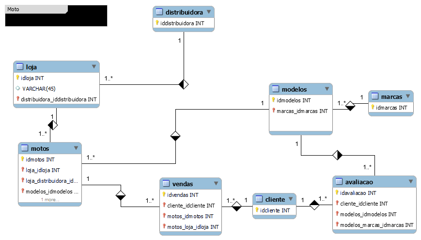

# Introdução:
Na escolha da primeira moto, alguns atributos devem ser analisados com atenção.\
 A distribuidora pode oferecer diferentes marcas e modelos para atender cada perfil.\
 A loja também tem um papel importante ao apresentar as opções disponíveis ao cliente.\
 O cliente deve comparar o preço de compra entre diferentes modelos.\
 O consumo de combustível é um fator importante para quem busca economia.\
 A potência e a cilindrada ajudam a definir o desempenho da moto.\
 O peso e a altura do banco influenciam diretamente na facilidade de pilotagem.\
 O custo de manutenção deve ser considerado antes de escolher uma marca.\
 A disponibilidade de peças também pode variar entre marcas e modelos.\
 O conforto é essencial para quem utiliza a moto diariamente.\
 Os equipamentos de segurança e a tecnologia podem trazer mais praticidade.\
 Cada cliente possui necessidades diferentes, seja para trabalho, lazer ou transporte.\
 Por isso, é importante analisar as características de cada modelo oferecido pela loja.\
 A distribuidora e a loja podem ajudar o cliente a conhecer as principais opções do mercado.\
 Com essas informações, o cliente consegue comparar marcas e modelos e encontrar a primeira moto mais adequada ao seu perfil.

(Rascunho do esquema das tabelas):

   
